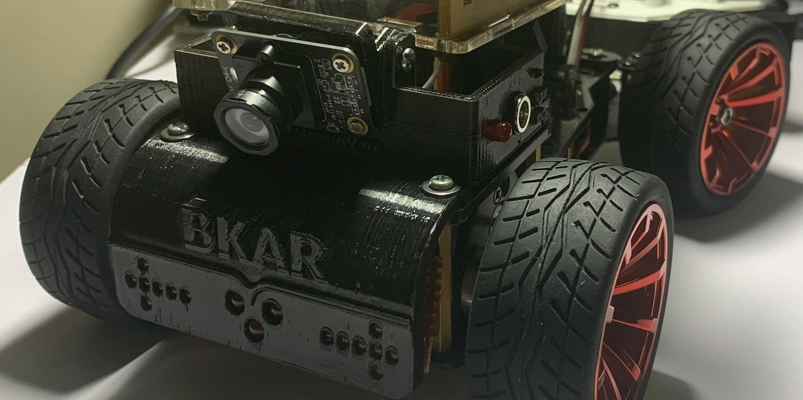

<h1 align='center'>Hệ thống camera 360 trên BKAR</h1>

    </img>

<h1>1. Phần cứng</h1>

    <ul>
    <li> Module Waveshare `IMX219-83` Stereo Camera  
    Sử dụng module Stereo Camera cho phía trước BKAR để lấy thông tin về chiều sâu, khoảng cách giữa xe với các đối tượng ở phía trước. Thay thế cho chức năng của LIDAR Sensor.</li>
    <li> 3 Module camera `CK77 94V-0`  
    Lý do chọn 3 module camera này vì mua được với giá rẻ. Tuy nhiên hệ thống hỗ trợ chúng sẽ cồng kềnh hơn vì cần mạch chuyển nguồn từ 5V sang 3.3V cho camera. </li>
    </ul>

<h1>2. Lắp đặt hệ thống</h1>

<h2>2.1. Camera phía trước</h2>

    </img>

<h2>2.2. Camera hai bên</h2>

    </img>

<h2>2.3. Camera sau</h2>

    </img>

<h1>3. Thiết kế phần mềm</h1>

<h1>4. Kết quả</h1>

